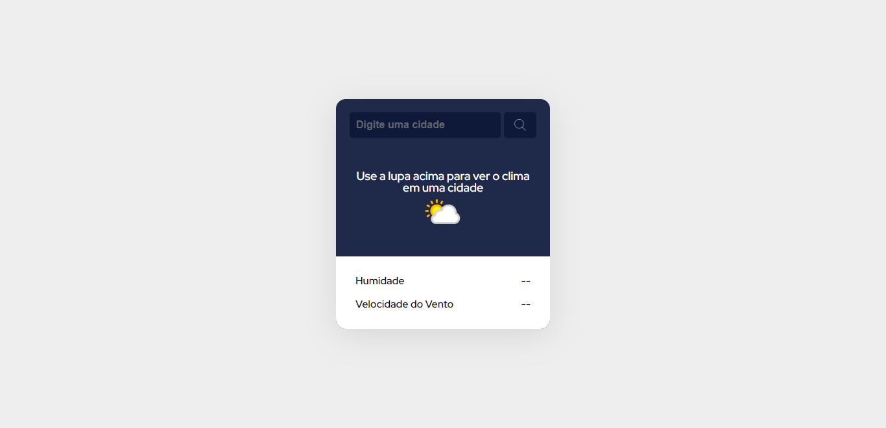

<h1 align="center"> Previsão do tempo </h1>

 

  <a href="#-tecnologias">Tecnologias</a>&nbsp;&nbsp;&nbsp;|&nbsp;&nbsp;&nbsp;
  <a href="#-projeto">Projeto</a>

 

  

## 🚀 Tecnologias

Esse projeto foi desenvolvido com as seguintes tecnologias:

- React.js
- Typescript
- Javascript
- Html e CSS
- Git e Github

## 💻 Projeto

Este é o projeto de um app de previsão do tempo, permitindo que o usuário pesquise o nome
de uma cidade e veja o clima atual da cidade através da WeatherAPI.

- [Acesse o projeto finalizado, online](https://app-weather-sand-eight.vercel.app/)
